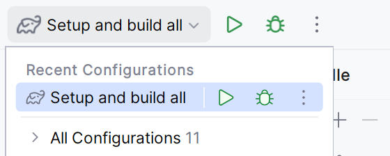

# Building server-side web applications with htmx

## Setup:

Please install the following:

* Java 21
* IntelliJ IDEA Community Edition or Ultimate
* [plugins.jetbrains.com/plugin/20588-htmx-support](https://plugins.jetbrains.com/plugin/20588-htmx-support)
* [plugins.jetbrains.com/plugin/14521-jte](https://plugins.jetbrains.com/plugin/14521-jte)
* Gradle

Please clone the Git repository:

```sh
git clone https://github.com/tschuehly/htmx-spring-workshop.git
```

## Info

In each lab there are checkpoints:

<figure><figcaption></figcaption></figure>

You can find a branch for each lab with multiple checkpoint commits you can start over with or compare against if you are stuck:

<figure><figcaption></figcaption></figure>

Only the relevant imports that need to be added are shown. Imports that have already been defined before are omitted.

## IntelliJ Code Template

To create a new ViewComponent with one click we can create a new IntelliJ Code Template.

Go to settings -> Editor -> File and Code Templates &#x20;

Click on the little plus icon

<figure><figcaption></figcaption></figure>

Name: `ViewComponent`

File Name: `${COMPONENT_NAME}Component.java`

```
package ${PACKAGE_NAME};

import de.tschuehly.spring.viewcomponent.core.component.ViewComponent;
import de.tschuehly.spring.viewcomponent.jte.ViewContext;

@ViewComponent
public class ${COMPONENT_NAME}Component {
  public record ${COMPONENT_NAME}Context() implements ViewContext{}

  public ViewContext render(){
    return new ${COMPONENT_NAME}Context();
  }
}
```

Then click on the plus next to the first one "Create Child Template"

<figure><figcaption></figcaption></figure>

File Name: `${COMPONENT_NAME}Component.jte`

Extension: `jte`

```
@import ${PACKAGE_NAME}.${COMPONENT_NAME}Component.${COMPONENT_NAME}Context
@param ${COMPONENT_NAME}Context ${COMPONENT_NAME.substring(0,1).toLowerCase()}${COMPONENT_NAME.substring(1)}Context
```

## Labs

### Lab 1: Server-side rendering with Spring Boot and JTE

This lab aims to build a simple user management application with base Spring Boot, JTE and htmx.

### Lab 2: Introducing Spring ViewComponent

In this lab, we refactor the application to use Spring ViewComponent and htmx-spring-boot to delegate rendering responsibility to the ViewComponents and remove it from the Controller.

### Lab 3: Inline Editing.

In this lab, we will create a group Management Page where we can add a user to a group and a navigation bar

### Lab 4: Using Spring Beans to Compose the UI

In this short lab, we will use the dependency injection capabilities of Spring to show a navigation bar where we can add new items by just creating new Components

### Lab 5: Lazy Loading

In this lab, we will lazily load the user table as it now contains a lot of users

### Lab 6: Full Text Search

In this lab, we will enable our users to search the user table.

### Lab 7: Infinite Scrolling using Pageable

In this lab, we will only load new users when we are scrolling down, improving our initial page speed

### Lab 8: Exception Messages

In this lab, we will catch Exception using a Spring Controller Advice and show them to the user in a nice form

### Lab 9: Server-Sent Events

In this lab, we will leverage the SSE capabilities of htmx to update our table live if a new user is created.
